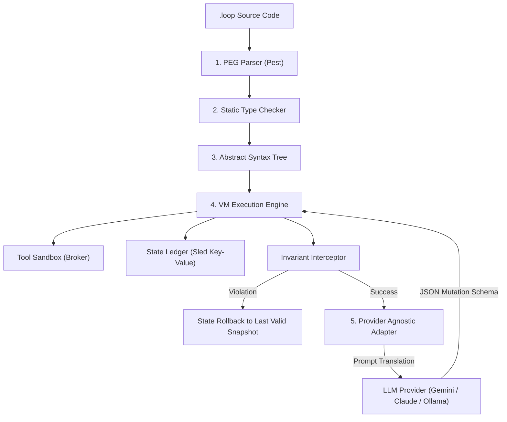

# Loop: Declarative Agentic Programming Language & Sandbox-Isolated Runtime

Developed by **Square Experience** (visit us at [www.squareexp.com](https://www.squareexp.com))

Loop is a domain-specific programming language (DSL), compiler front-end, and secure sandbox execution runtime written in Rust. It is engineered to define, type-check, and run autonomous AI agent loops under strict safety invariants and isolated system guardrails.

---

## Core Philosophy: Why Loop?

Traditional agentic frameworks rely on general-purpose Python scripts to execute loops, reason, and run tools. This approach introduces significant risks:
- **Runaway Logic**: Agents can get stuck in infinite reasoning loops, ballooning API costs.
- **State Corruption**: Hard-to-trace state changes across multiple steps can lead to inconsistent agent behavior.
- **Security Risks**: Giving an LLM direct command-line access can compromise the host machine.
- **Context Inflation**: Long histories degrade model performance and increase token costs.

Loop solves these challenges by enforcing a declarative structure:
1. **Predictable State Ledger**: All agent memory and state variables are managed in an embedded key-value database (`sled`).
2. **Synchronous Invariant Check**: Safety checks run immediately after every tool execution. If an invariant is violated, the runtime rolls back the state to the latest valid snapshot.
3. **Isolated Sandbox Broker**: System tools run in isolated environments with path traversal prevention.
4. **Provider-Agnostic Switching**: Swap LLM providers mid-session (e.g., from Gemini to Claude) to prevent model lock-in and optimize costs without losing session memory.

---

## Architecture Overview



---

## Language Reference: DSL Specifications

A Loop program is defined using a clean, declarative DSL. Below is a specification of the blocks that make up a `.loop` script:

### 1. `task`
Defines the high-level objective for the agent.
```
task {
    "Search the codebase, locate the deprecated database module, and replace it with the new key-value client."
}
```

### 2. `state`
Defines the schema and initial values for the agent's memory. Supports primitive types: `string`, `int`, and `bool`.
```
state {
    current_step: 0,
    is_completed: false,
    error_count: 0
}
```

### 3. `tools`
Declares the set of safe functions the agent is allowed to execute in the sandbox.
```
tools {
    tool read_file(path: string) -> string
    tool write_file(path: string, content: string) -> bool
    tool list_dir(dir_path: string) -> string
}
```

### 4. `invariant`
Specifies assertions that must hold true after every single tool execution. If an invariant evaluates to `false`, the execution is halted, and state is rolled back.
```
invariant {
    state.error_count < 3
}
```

### 5. `strategy`
Guidelines that instruct the model on how to solve the task.
```
strategy {
    "Analyze the directory contents first, locate files containing references to the old client, and then edit them."
}
```

### 6. `until`
Defines the terminal condition for the loop. Once this condition is met, the loop exits successfully.
```
until {
    state.is_completed == true
}
```

### 7. `fallback`
Defines the backup strategy or error reporting block to execute if the terminal condition cannot be met within the loop limits.
```
fallback {
    "Log the error details and notify the supervisor."
}
```

---

## Installation

Ensure you have Rust and Cargo installed (v1.85+ recommended).

```bash
# Clone the repository
git clone https://github.com/squareexp/loop.git
cd loop

# Build the release binary
cargo build --release
```

The compiled binary will be available at `target/release/loop`.

---

## Command Line Interface (CLI)

The Loop CLI manages compilation, environment isolation, and session state tracking.

### Running a Loop Script
To execute a loop script, provide the file path, the selected provider, and a session identifier:
```bash
# Run with Gemini
loop run migration.loop --provider gemini --session-id migration_session_01

# Run with Claude
loop run migration.loop --provider claude --session-id migration_session_01
```

### Switch Providers Mid-Session
If you hit budget limits or if a model struggles with a task, you can switch providers mid-session. The runtime switches the prompt translation layer and resets the model's chat history, but **restores all state ledger variables** from `sled`, saving memory and context tokens:
```bash
loop switch migration.loop --provider claude --session-id migration_session_01
```

---

## Developer Tooling: VS Code Extension

For syntax highlighting and configuration support, install the **LoopAgent** VS Code extension.

### Features
- Complete keyword highlights (`task`, `state`, `tools`, `invariant`, `strategy`, `until`, `fallback`, `tool`).
- Type highlighting for primitives (`string`, `int`, `bool`).
- Configured with the official neon-lime brand icon.

### Manual Installation
You can build and install the extension package locally:
```bash
# Package the extension
cd extensions/vscode
npx -y @vscode/vsce package
```
Install the resulting `.vsix` file in VS Code via **Extensions -> ... -> Install from VSIX...**.

---

## Project Roadmap

We are actively developing Loop. The following features are planned for future releases:

### Phase 1: Core DSL Improvements
- Support for complex schemas (nested objects and arrays) in the `state` block.
- Floating-point arithmetic and logical primitives.
- High-fidelity compile-time diagnostics pointing to exact line and column numbers.

### Phase 2: Sandbox Isolation
- WebAssembly (WASM) sandbox for executing arbitrary helper scripts safely.
- Docker integration for worktree isolation.
- Resource constraints configuration (limiting memory, CPU time, and file handles).

### Phase 3: Telemetry & Monitoring
- Interactive debugging console to pause execution and inspect the state ledger.
- Dashboard web application for live session metrics, budget alerts, and log visualization.

---

## Contact & Contribution

Loop is maintained by **Square Experience**.
- Website: [www.squareexp.com](https://www.squareexp.com)
- Repository: [github.com/squareexp/loop](https://github.com/squareexp/loop)

For bugs, feature requests, or inquiries, please open an issue in the repository. Licensed under the MIT License.
